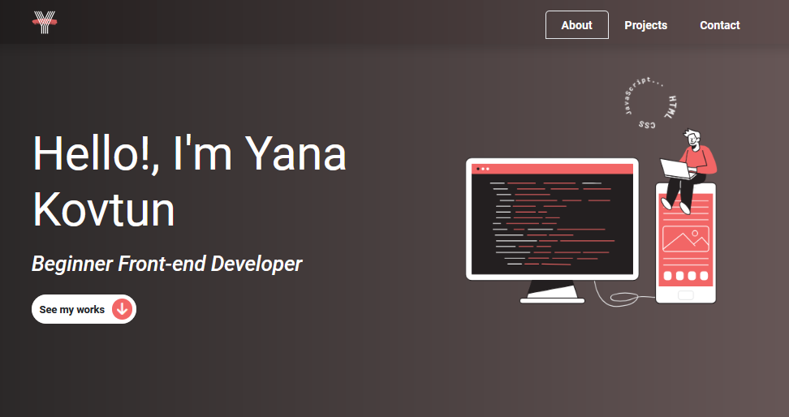

<h1 align="center">My Portfolio</h1>
<h2 align="center">

</h2>

<h3 align="center">
    <a href="https://yana-kovtun.netlify.app/" target="_blank">Life Demo</a>
</h3>

### Description
___
This is a portfolio site with my main works. All these sites are on my <a href="https://github.com/liyakot?tab=repositories">github</a>. 

The project was created using Bootstrap 5 and SCSS. 

### Additionally
___

I've learned myself web development without any courses or training, so if you have any comments, I will be happy to chat with you on social networks (see  my <a href="https://github.com/liyakot">profile</a> :fire:)
